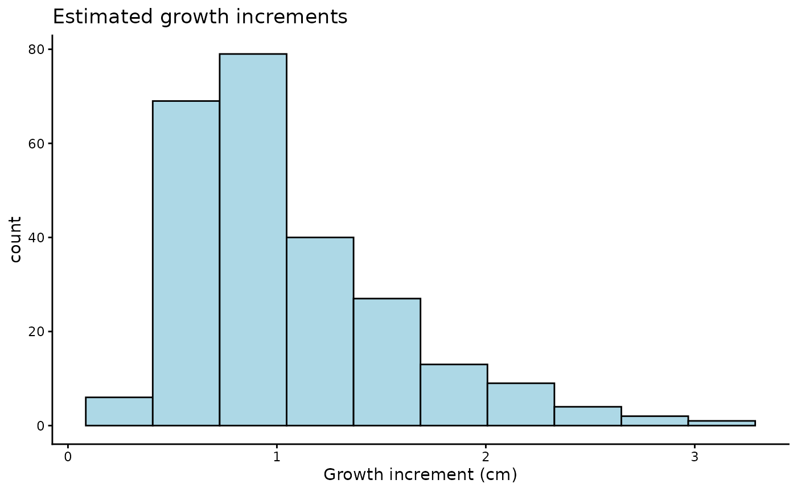
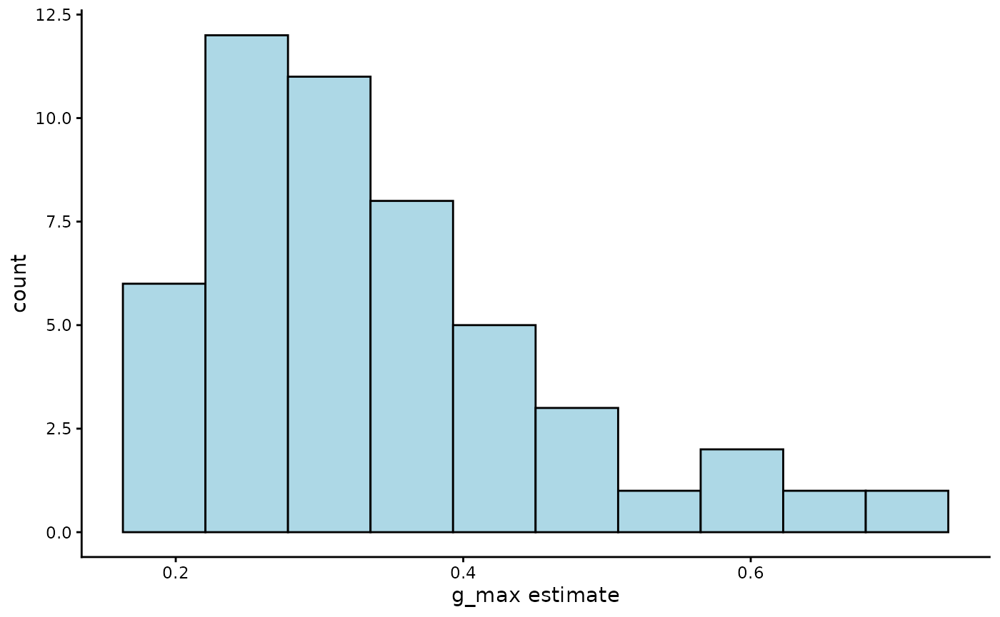
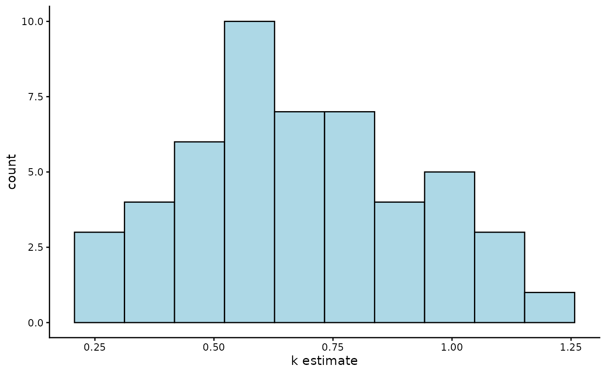
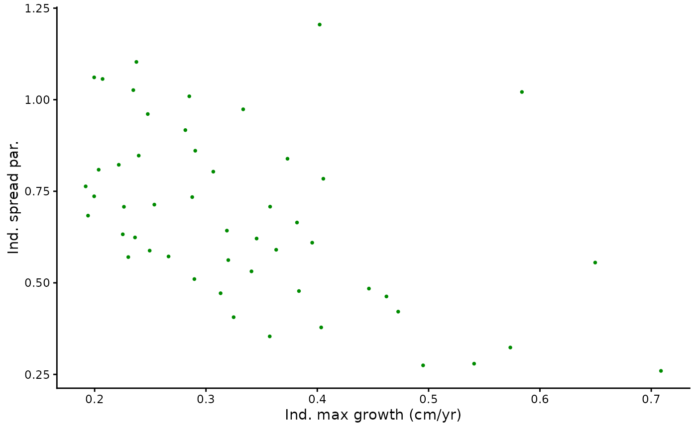

# Case study 3: Canham function growth with tree data from Barro Colorado Island

``` r
library(hmde)
library(dplyr)
#> 
#> Attaching package: 'dplyr'
#> The following objects are masked from 'package:stats':
#> 
#>     filter, lag
#> The following objects are masked from 'package:base':
#> 
#>     intersect, setdiff, setequal, union
library(ggplot2)
```

Our final case study reproduces analysis from O’Brien, Warton, and
Falster (2024) with a small sample size for G. recondita in order to
make the model tractable for a demonstration.

The function we use here is based on Canham, LePage, and Coates (2004),
and is a three parameter non-linear ODE given by
$$g\left( S(t);\, g_{max},S_{max},k \right) = g_{max}\exp( - \frac{1}{2}(\frac{\ln\left( S(t)/S_{max} \right)}{k})^{2}).$$
The Canham function, as we refer to it, describes hum-shaped growth that
accelerates to a peak at $\left( S_{max},g_{max} \right)$ then declines
to 0 at a rate controlled by $k$. The Canham function does not have an
analytic solution the way that the previous function did, so we are
unable to directly encode the sizes over time and must instead use a
numerical method.

The Canham function has been used for a lot of growth analysis such as
Herault et al. (2011) and Canham et al. (2006) as well as our own
previous work in O’Brien, Warton, and Falster (2024) and \[Paper 2\].
The desirable features of the Canham growth model are that it has a
period of increasing growth at small sizes, with a finite growth peak at
$\left( S_{max},g_{max} \right)$, and then decay to near-zero growth.
With different parameter combinations Canham can fit a range of growth
behaviours to an observed interval: increasing growth, decreasing
growth, a growth spike, or steady growth. The downside is that the
Canham function is unimodal – it can only fit a single peak and as such
is not suitable to describe the full life history of species that are
strongly responsive to their environment as seen in \[Paper 2\].

The next bit of code plots the Canham function for chosen parameter
values. We have provided some, but encourage playing around with the
parameters and seeing what happens to the function.

``` r
g_max <- 1 #Max growth rate
S_max <- 10 #Size at which the maximum growth occurs
k <- 0.75
y_0 <- 1 #Starting size
y_final <- 40

#Plot of growth function
ggplot() +
  xlim(y_0, y_final) +
  labs(x = "Y(t)", y = "f", title = "Canham growth") +
  theme_classic() +
  theme(axis.text=element_text(size=16),
        axis.title=element_text(size=18,face="bold")) +
  geom_function(fun=hmde_model_des("canham_single_ind"),
                args=list(pars = list(g_max, S_max, k)),
                colour="green4", linewidth=1,
                xlim=c(y_0, y_final))
```


The default priors for the Canham top-level parameters for the single
individual model are
$$g_{max} \sim \log\mathcal{N}(0,2),$$$$S_{max} \sim \log\mathcal{N}(0,2),$$$$k \sim \log\mathcal{N}(0,2)$$$$0 < \sigma_{e} \sim Cauchy(0,2).$$
For the multi-individual model the prior structure and default
parameters are
$$\mu_{g_{max}} \sim \mathcal{N}(0,2),$$$$0 < \sigma_{g_{max}} \sim Cauchy(0,2),$$$$\mu_{S_{max}} \sim \mathcal{N}(0,2),$$$$0 < \sigma_{S_{max}} \sim Cauchy(0,2),$$$$\mu_{k} \sim \mathcal{N}(0,2),$$$$0 < \sigma_{k} \sim \sim Cauchy(0,2),$$$$0 < \sigma_{e} \sim Cauchy(0,2).$$
To see the name for the prior parameter run `hmde_model`. For example in
the following we want to change the prior for $g_{max}$
(`ind_max_growth`) in the individual model:

``` r
hmde_model("canham_single_ind")
#> [1] "Model: canham_single_ind"
#> [1] "Input data template:"
#> $n_obs
#> NULL
#> 
#> $y_obs
#> NULL
#> 
#> $obs_index
#> NULL
#> 
#> $time
#> NULL
#> 
#> $prior_pars_ind_max_growth
#> [1] 0 2
#> 
#> $prior_pars_ind_size_at_max_growth
#> [1] 0 2
#> 
#> $prior_pars_ind_k
#> [1] 0 2
#> 
#> $prior_pars_global_error_sigma
#> [1] 0 2
#> 
#> $model
#> [1] "canham_single_ind"
#prior_pars_ind_max_growth is the argument name for the prior parameters
```

The data we use for this demonstration comes from the Barro Colorado
Island long term forest plot Condit et al. (2019). We have a simple
random sample without replacement of 50 individuals from , subject to
the following inclusion criteria for individuals:

As some exploratory analysis we’re going to look at the size and growth
increment distributions.

``` r
hist(Tree_Size_Data$y_obs,
     xlab = "Size (cm)", main ="")
```


``` r

Tree_Size_Data_Transformed <- Tree_Size_Data %>%
  group_by(ind_id) %>%
  mutate(Delta_y_obs = y_obs - lag(y_obs)) %>%
  ungroup() %>%
  arrange(ind_id, time) %>%
  filter(!is.na(Delta_y_obs))

hist(Tree_Size_Data_Transformed$Delta_y_obs,
     xlab = "Growth increment (cm)", main="")
```


Due to the complexity of the Canham model the sampling can take up to 3
hours. If you decide to run your own samples we recommend saving the
model outputs using [`saveRDS()`](https://rdrr.io/r/base/readRDS.html)
so you don’t need to rerun your model every time. We provide a data set
of estimates with the package in the `Tree_Size_Ests` data file which
can be accessed directly.

``` r
tree_canham_fit <- hmde_model("canham_multi_ind") |>
  hmde_assign_data(data = Tree_Size_Data)  |>
  hmde_run(chains = 4, cores = 4, iter = 2000)

tree_canham_estimates <- hmde_extract_estimates(fit = tree_canham_fit,
                                 input_measurement_data = Tree_Size_Data)

#saveRDS(tree_canham_fit, "tree_canham_fit.rds")
#saveRDS(tree_canham_estimates, "tree_canham_estimates.rds")
```

The model analysis follows the same workflow as the previous
demonstrations: we look at how individual sizes over time and fitted
growth functions behave, then examine evidence of relationships between
parameter values at the individual level. We also look at the
species-level parameter CIs and estimates.

``` r
measurement_data_transformed <- Tree_Size_Ests$measurement_data %>%
  group_by(ind_id) %>%
  mutate(
    delta_y_obs = y_obs - lag(y_obs),
    obs_interval = time - lag(time),
    obs_growth_rate = delta_y_obs/obs_interval,
    delta_y_est = y_hat - lag(y_hat),
    est_growth_rate = delta_y_est/obs_interval
  ) %>%
  ungroup()

#Distributions of estimated growth and size
ggplot(measurement_data_transformed, 
       aes(y_hat)) +
  geom_histogram(bins = 10,
                 colour = "black",
                 fill = "lightblue") +
  labs(x="Size (cm)",
       title = "Estimated size distribution") +
  theme_classic()
```


``` r

ggplot(measurement_data_transformed, 
       aes(delta_y_est)) +
  geom_histogram(bins = 10,
                 colour = "black",
                 fill = "lightblue") +
  labs(x = "Growth increment (cm)",
       title = "Estimated growth increments") +
  theme_classic()
#> Warning: Removed 50 rows containing non-finite outside the scale range
#> (`stat_bin()`).
```



``` r

ggplot(measurement_data_transformed, 
       aes(est_growth_rate)) +
  geom_histogram(bins = 10,
                 colour = "black",
                 fill = "lightblue") +
  labs(x = "Growth rate (cm/yr)",
       title = "Estimated annualised growth rate distribution") +
  theme_classic()
#> Warning: Removed 50 rows containing non-finite outside the scale range
#> (`stat_bin()`).
```


``` r

#Quantitative R^2
cor(measurement_data_transformed$y_obs, measurement_data_transformed$y_hat)^2
#> [1] 0.9975655

r_sq_est <- cor(Tree_Size_Ests$measurement_data$y_obs,
                Tree_Size_Ests$measurement_data$y_hat)^2
r_sq <- paste0("R^2 = ", 
               signif(r_sq_est,
                      digits = 3))

obs_est_scatter <- ggplot(data = Tree_Size_Ests$measurement_data, 
       aes(x = y_obs, y = y_hat)) +
  geom_point(shape = 16, size = 1, colour = "green4") +
  xlab("Y obs.") +
  ylab("Y est.") +
  geom_abline(slope = 1, linetype = "dashed") +
  annotate("text", x = 7, y = 22, 
           label = r_sq) +
  theme_classic()
obs_est_scatter
```


``` r

#Plots of size over time for a sample of 5 individuals
obs_est_size_plot <- hmde_plot_obs_est_inds(n_ind_to_plot = 5,
                       measurement_data = Tree_Size_Ests$measurement_data) +
  theme(legend.position = "inside",
        legend.position.inside = c(0.1, 0.85)) +
  guides(colour=guide_legend(nrow=2,byrow=TRUE))
obs_est_size_plot
```


Individual parameter analysis, growth function plots follow this.

``` r
#1-dimensional parameter distributions
ggplot(Tree_Size_Ests$individual_data, 
       aes(ind_max_growth_mean)) +
  geom_histogram(bins = 10,
                 colour = "black",
                 fill = "lightblue") +
  labs(x="g_max estimate") +
  theme_classic()
```



``` r

ggplot(Tree_Size_Ests$individual_data, 
       aes(ind_size_at_max_growth_mean)) +
  geom_histogram(bins = 10,
                 colour = "black",
                 fill = "lightblue") +
  labs(x="S_max estimate") +
  theme_classic()
```


``` r

ggplot(Tree_Size_Ests$individual_data, 
       aes(ind_k_mean)) +
  geom_histogram(bins = 10,
                 colour = "black",
                 fill = "lightblue") +
  labs(x="k estimate") +
  theme_classic()
```



``` r

#2-dimensional parameter distributions
pairplot1 <- ggplot(data = Tree_Size_Ests$individual_data,
       aes(x = ind_max_growth_mean, y = ind_size_at_max_growth_mean)) +
  geom_point(shape = 16, size = 1, colour = "green4") +
  xlab("Ind. max growth (cm/yr)") +
  ylab("Ind. size at max growth (cm)") +
  theme_classic()

pairplot2 <- ggplot(data = Tree_Size_Ests$individual_data,
       aes(x = ind_max_growth_mean, y = ind_k_mean)) +
  geom_point(shape = 16, size = 1, colour = "green4") +
  xlab("Ind. max growth (cm/yr)") +
  ylab("Ind. spread par.") +
  theme_classic()

pairplot3 <- ggplot(data = Tree_Size_Ests$individual_data,
       aes(x = ind_k_mean, y = ind_size_at_max_growth_mean)) +
  geom_point(shape = 16, size = 1, colour = "green4") +
  xlab("Ind. spread par.") +
  ylab("Ind. size at max growth (cm)") +
  theme_classic()

pairplot1
```


``` r
pairplot2
```



``` r
pairplot3
```


``` r

#monotonic correlation of parameters
cor(Tree_Size_Ests$individual_data[,c(2,6,10)], method="spearman")
#>                             ind_max_growth_mean ind_size_at_max_growth_mean
#> ind_max_growth_mean                   1.0000000                   0.1714766
#> ind_size_at_max_growth_mean           0.1714766                   1.0000000
#> ind_k_mean                           -0.5167347                  -0.2566627
#>                             ind_k_mean
#> ind_max_growth_mean         -0.5167347
#> ind_size_at_max_growth_mean -0.2566627
#> ind_k_mean                   1.0000000

#Plot function pieces over estimated sizes.
est_de_plot <- hmde_plot_de_pieces(Tree_Size_Ests)
est_de_plot
```


At the hyper-parameter level for the whole population we have centre and
spread parameters for the log-normal distributions of $g_{max}$,
$S_{max}$ and $k$.

``` r
pars_CI_names <- c(
  "mean log max growth rate",
  "mean max growth rate in cm/yr",
  "log max growth rate standard deviation",
  "mean log size at max growth rate",
  "mean max size at max growth rate in cm",
  "log max size at growth rate standard deviation",
  "mean mean log spread parameter",
  "mean mean spread parameter",
  "log spread parameter standard deviation"
)

#Vector that picks out which pars to be exponentiated
exp_vec <- c(FALSE, TRUE, FALSE, 
             FALSE, TRUE, FALSE,
             FALSE, TRUE, FALSE)

#Print mean estimates and CIs
for(i in 1:nrow(Tree_Size_Ests$population_data)){
  if(!exp_vec[i]){
    print(paste0(pars_CI_names[i],
                 " estimate: ",
                 Tree_Size_Ests$population_data$mean[i] ))
    print(paste0("95% CI for ", 
                 pars_CI_names[i],
                 ": (",
                 Tree_Size_Ests$population_data$CI_lower[i],
                 ", ",
                 Tree_Size_Ests$population_data$CI_upper[i],
                 ")"))
  } else {
    print(paste0(pars_CI_names[i],
                 " estimate: ",
                 exp(Tree_Size_Ests$population_data$mean[i])))
    print(paste0("95% CI for ",
                 pars_CI_names[i], 
                 ": (",
                 exp(Tree_Size_Ests$population_data$CI_lower[i]),
                 ", ",
                 exp(Tree_Size_Ests$population_data$CI_upper[i]),
                 ")"))
  }
}
#> [1] "mean log max growth rate estimate: -1.17926905960628"
#> [1] "95% CI for mean log max growth rate: (-1.35436217487034, -1.0097451150757)"
#> [1] "mean max growth rate in cm/yr estimate: 1.54915299226772"
#> [1] "95% CI for mean max growth rate in cm/yr: (1.38279241021618, 1.75860470370369)"
#> [1] "log max growth rate standard deviation estimate: 2.31924077864107"
#> [1] "95% CI for log max growth rate standard deviation: (2.14197700118498, 2.51005094657254)"
#> [1] "mean log size at max growth rate estimate: 0.385303309010744"
#> [1] "95% CI for mean log size at max growth rate: (0.236341614765895, 0.552561575432935)"
#> [1] "mean max size at max growth rate in cm estimate: 0.56896188306983"
#> [1] "95% CI for mean max size at max growth rate in cm: (0.422533038841024, 0.803549795885537)"
#> [1] "log max size at growth rate standard deviation estimate: 0.583806457525299"
#> [1] "95% CI for log max size at growth rate standard deviation: (0.351536816347528, 0.866585624778698)"
```

## References

Canham, Charles D, Philip T LePage, and K Dave Coates. 2004. “A
Neighborhood Analysis of Canopy Tree Competition: Effects of Shading
Versus Crowding.” *Canadian Journal of Forest Research* 34 (4): 778–87.

Canham, Charles D, Michael J Papaik, Marı́a Uriarte, William H
McWilliams, Jennifer C Jenkins, and Mark J Twery. 2006. “Neighborhood
Analyses of Canopy Tree Competition Along Environmental Gradients in New
England Forests.” *Ecological Applications* 16 (2): 540–54.

Condit, R, R Pérez, S Aguilar, S Lao, R Foster, and S. P. Hubbell. 2019.
“Complete Data from the Barro Colorado 50-Ha Plot: 423617 Trees, 35
Years, 2019 Version.”

Herault, Bruno, Bénédicte Bachelot, Lourens Poorter, Vivien Rossi, Frans
Bongers, Jérôme Chave, CE Timothy Paine, Fabien Wagner, and Christopher
Baraloto. 2011. “Functional Traits Shape Ontogenetic Growth Trajectories
of Rain Forest Tree Species.” *Journal of Ecology* 99 (6): 1431–40.

O’Brien, Tess, David Warton, and Daniel Falster. 2024. “Yes, They’re All
Individuals: Hierarchical Models for Repeat Survey Data Improve
Estimates of Tree Growth and Sie.” *Methods in Ecology and Evolution*.
