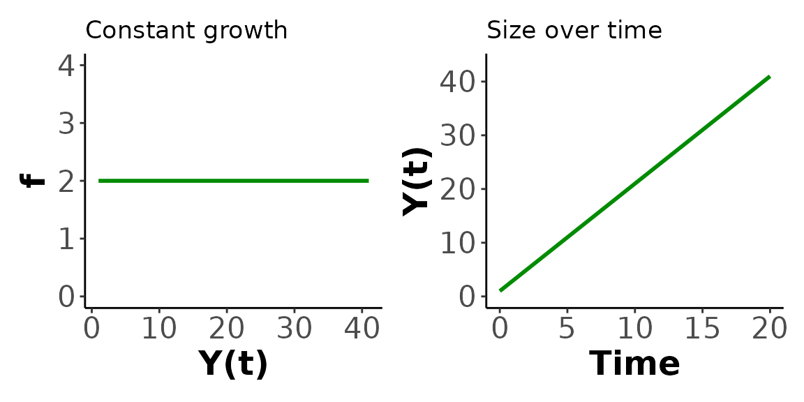
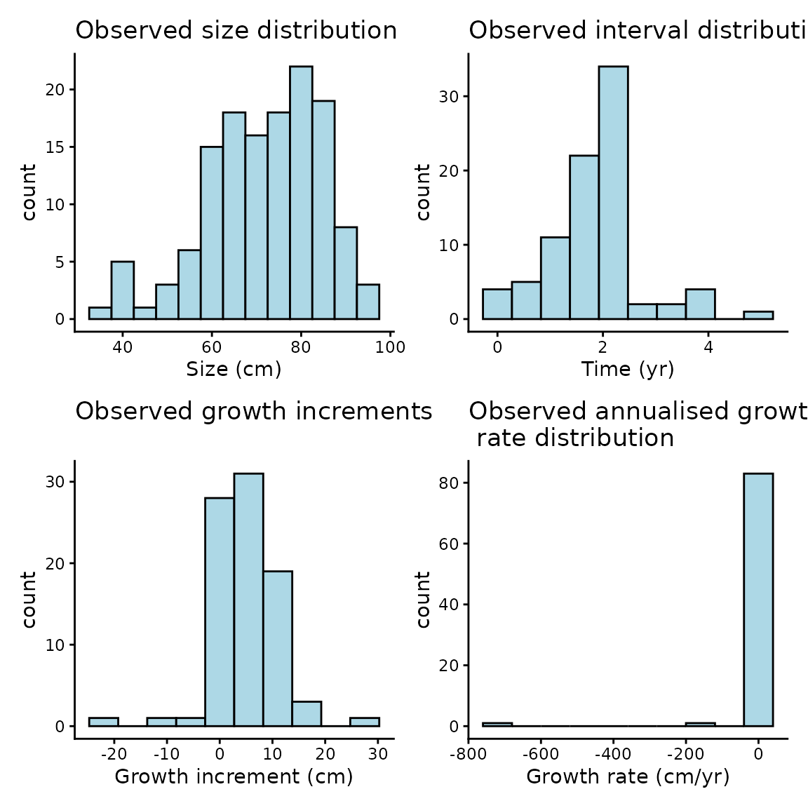
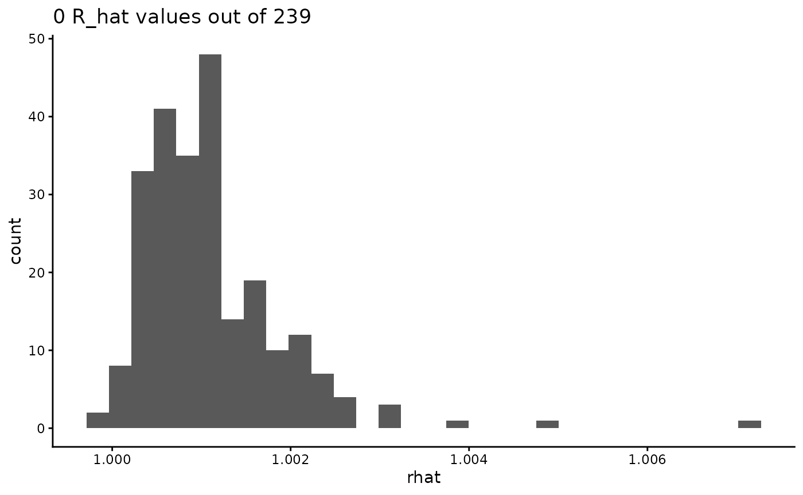
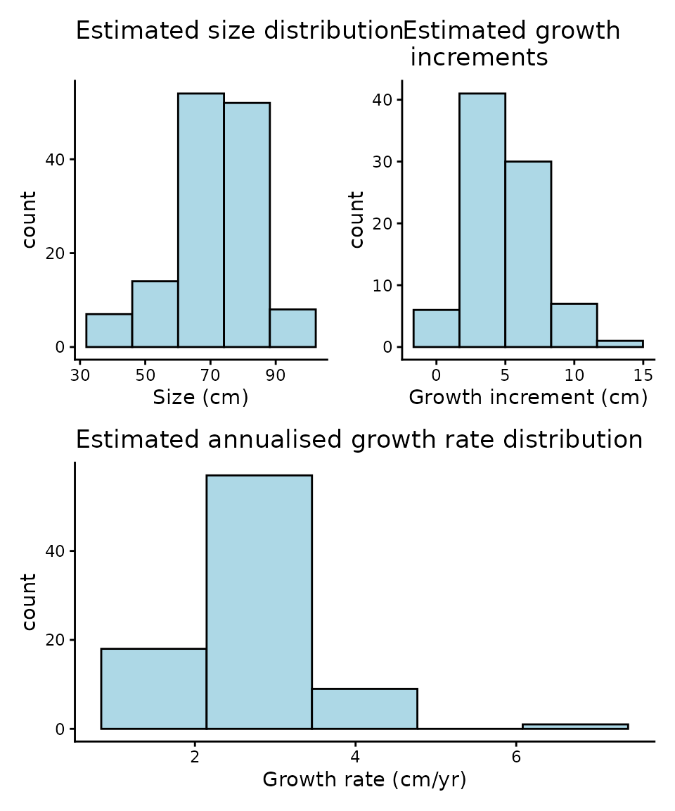
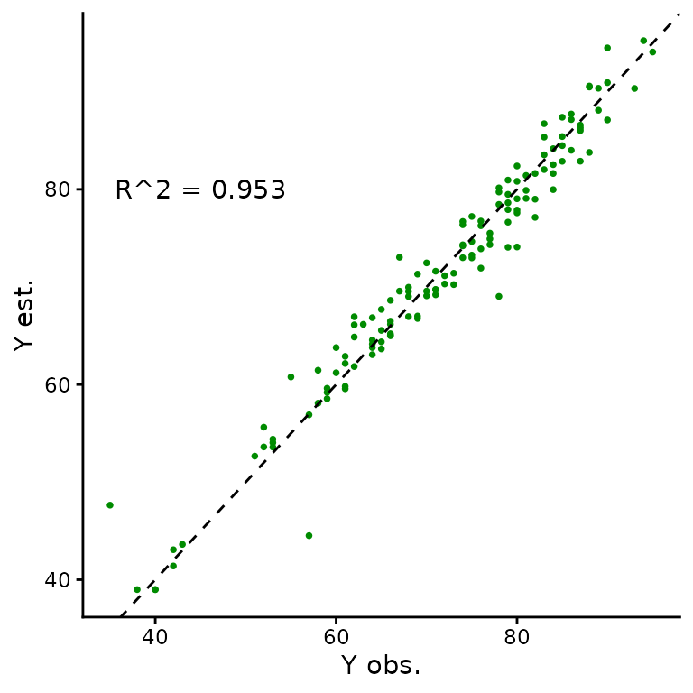
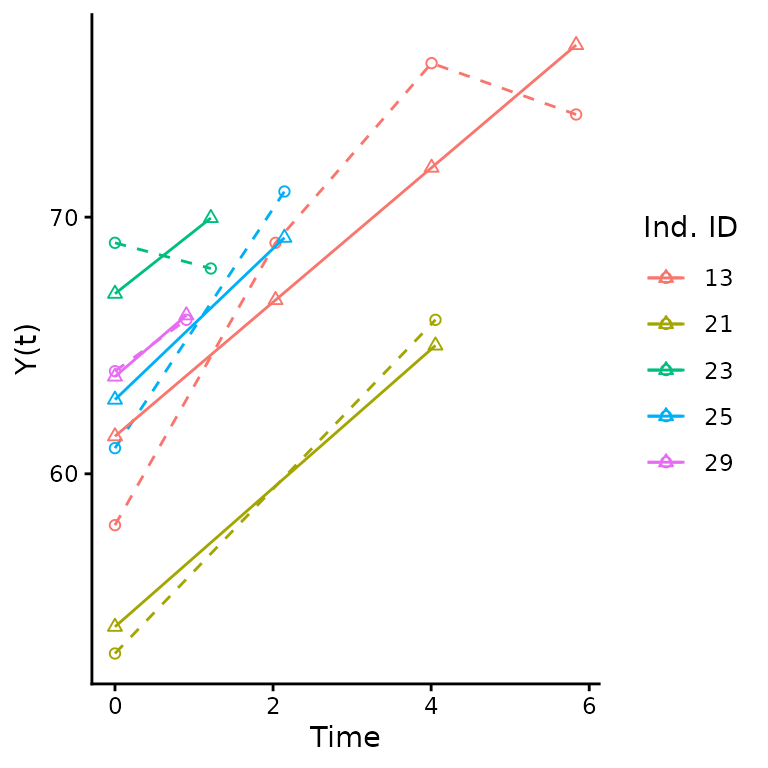
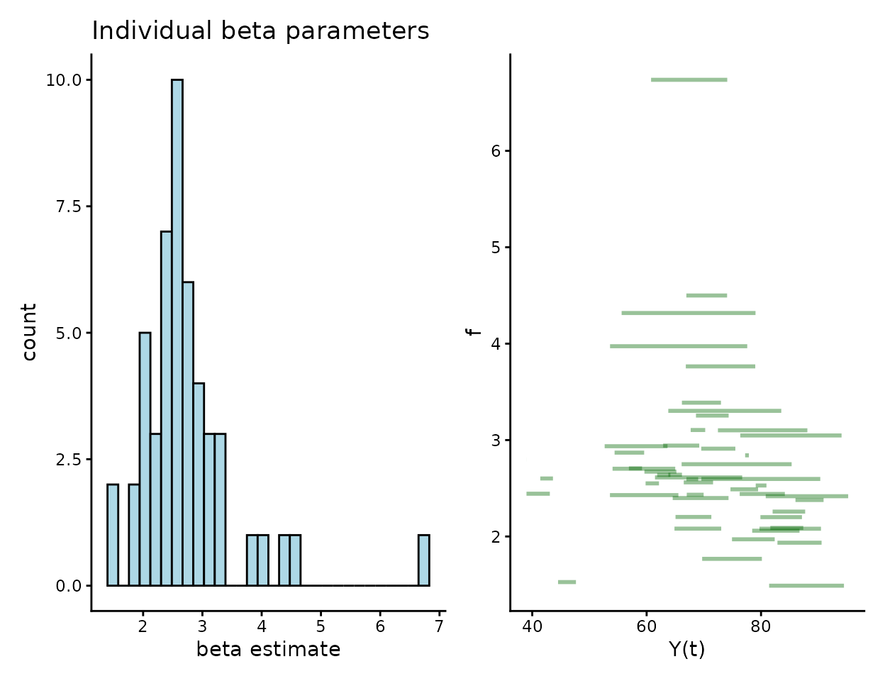

# Case study 1: Constant growth with SUSTAIN Trout data

## Overview

In circumstances where the number of observations available per
individual is very limited, average growth rates over time may be the
only plausible model to fit. In particular, if there are individuals
with only two size observations, than the best that can be done is a
single estimate of growth rate based on that interval. Such a model
behaves as **constant growth**, which we can think of as the average
rate of change across the observation period and is given by
``` math
\begin{equation}\tag{3}\label{eqn_3_const}
f(Y(t), \beta) = \beta
\end{equation}
```
where $`\beta`$ is the average growth rate. The constant growth model
corresponds to linear sizes over time, and is equivalent to a linear
mixed model for size, where there is an individual effect when fit to
multiple individuals.

### Load dependencies

``` r

# remotes::install_github("traitecoevo/hmde")
# install.packages(c("dplyr", "ggplot2"))

library(hmde)
library(dplyr)
library(ggplot2)
```

### Priors

The default priors for the constant top-level parameters in the single
individual model are
``` math
\beta\sim \log\mathcal{N}(0, 2),
```
``` math
0 <\sigma_e \sim Cauchy(0, 2).
```

For the multi-individual model the prior structure and default
parameters are
``` math
\mu_{\beta} \sim \mathcal{N}(0, 2),
```
``` math
0 < \sigma_{\beta} \sim Cauchy(0, 2),
```
``` math
0 < \sigma_{e} \sim Cauchy(0, 2).
```
To change the prior parameter values (the distributions are fixed)
optional arguments can be passed to `hmde_data template` with names
corresponding to the `prior_pars` argument for the associated parameter
as output by `hmde_models()`. For example in the following we want to
change the prior for $`\beta`$ (`ind_beta`) in the individual model:

``` r

prior_pars(hmde_model("constant_single_ind"))
#> $prior_pars_ind_beta
#> [1] 0 2
#> 
#> $prior_pars_global_error_sigma
#> [1] 0 2
#prior_pars_ind_beta is the argument name for the prior parameters
```

The mean passed to a log-normal distribution is the mean of the
**underlying normal distribution**, so if you want to pass a value based
on raw observations you need to log-transform it first.

Let’s simulate some data to visualise the constant growth function.

### Simulate data

``` r

beta <- 2 #Annual growth rate
y_0 <- 1 #Starting size
time <- 0:20 
sizes_over_time <- tibble(Y_t = 1 + beta*time, #Linear sizes over time
                          t = time)

sizes_over_time
#> # A tibble: 21 × 2
#>      Y_t     t
#>    <dbl> <int>
#>  1     1     0
#>  2     3     1
#>  3     5     2
#>  4     7     3
#>  5     9     4
#>  6    11     5
#>  7    13     6
#>  8    15     7
#>  9    17     8
#> 10    19     9
#> # ℹ 11 more rows
```

### Visualise data

Here are some plots to demonstrate how the constant growth function
relates to sizes over time for a single individual. Feel free to play
around with the parameter settings (`beta`, `y_0`) and see how the plot
changes.



``` r

#Plot of growth function
ggplot() +
  geom_function(fun = hmde_model_des("constant_single_ind"), # Visualising the growth function
                args = list(pars = list(beta)),
                colour = "green4", linewidth=1,
                xlim = c(y_0, max(sizes_over_time))) + 
  xlim(y_0, max(sizes_over_time$Y_t)) + # Creating the x axis
  ylim(0, beta*2) + # Creating the y axis
  labs(x = "Y(t)", y = "f", title = "Constant growth") + # Axe labels and plot title
  theme_classic() + # Theme for the plot
  theme(axis.text=element_text(size=16), # Plot customising
        axis.title=element_text(size=18,face="bold")) 

#Sizes over time
ggplot(data = sizes_over_time, aes(x=t, y = Y_t)) + 
  geom_line(colour="green4", linewidth=1) + # Line graph of sizes_over_time
  xlim(0, max(sizes_over_time$t)) +
  ylim(0, max(sizes_over_time$Y_t)*1.05) +
  labs(x = "Time", y = "Y(t)", title = "Constant growth") +
  theme_classic() +
  theme(axis.text=element_text(size=16),
        axis.title=element_text(size=18,face="bold"))
```

A key take-away of the function plot (on the left) is the relationship
to what we think of as a “reasonable growth model”. We don’t expect
constant growth rates to be realistic, at best they represent the
average rate of change over a period. More complex models may be more
realistic, but in this case study we are only interested in different
mechanisms of size dependence, we do not use environmental covariates
for example.

## SUSTAIN trout data

Our example data for the constant model comes from Moe et al. (2020), a
publicly available dataset of mark-recapture data for *Salmo trutta* in
Norway. The time between observations is not controlled, nor is the
number of observations per individual. As a result the data consists
primarily of individuals with two observations of size, constituting a
single observation of growth which limits the growth functions that can
be fit to individuals as a single parameter model is the best that can
be fit to two sizes. The constant growth function in Equation is the
most appropriate of the functions we have in `hmde`, as we can interpret
the single growth interval as an estimate of the average growth rate
that gets fit to $`\beta`$.

In order to best reflect the survey data we took a stratified sample of
individuals grouped by the number of available observations. We have 25
fish with two observations, 15 with three, 10 with four, for a total
sample size of 50. This data is included with `hmde`

``` r

Trout_Size_Data
#> # A tibble: 135 × 4
#>    ind_id  time y_obs obs_index
#>     <dbl> <dbl> <dbl>     <dbl>
#>  1      1  0       52         1
#>  2      1  1.91    60         2
#>  3      1  4.02    70         3
#>  4      1  6.04    80         4
#>  5      2  0       80         1
#>  6      2  1.90    85         2
#>  7      2  3.94    93         3
#>  8      2  5.96    94         4
#>  9      3  0       52         1
#> 10      3  2.03    65         2
#> # ℹ 125 more rows
```

### Transform data

As initial exploration we will have a look at the distribution of
observed sizes, growth behaviour, and observation intervals. First we
transform the data to extract growth increment and observation interval
information, then plot it.

``` r

Trout_Size_Data_transformed <- Trout_Size_Data %>%
  group_by(ind_id) %>%
  mutate(
    delta_y_obs = y_obs - lag(y_obs),
    obs_interval = time - lag(time),
    obs_growth_rate = delta_y_obs/obs_interval
  ) %>%
  ungroup()

Trout_Size_Data_transformed
#> # A tibble: 135 × 7
#>    ind_id  time y_obs obs_index delta_y_obs obs_interval obs_growth_rate
#>     <dbl> <dbl> <dbl>     <dbl>       <dbl>        <dbl>           <dbl>
#>  1      1  0       52         1          NA        NA             NA    
#>  2      1  1.91    60         2           8         1.91           4.18 
#>  3      1  4.02    70         3          10         2.11           4.75 
#>  4      1  6.04    80         4          10         2.02           4.96 
#>  5      2  0       80         1          NA        NA             NA    
#>  6      2  1.90    85         2           5         1.90           2.64 
#>  7      2  3.94    93         3           8         2.04           3.92 
#>  8      2  5.96    94         4           1         2.03           0.494
#>  9      3  0       52         1          NA        NA             NA    
#> 10      3  2.03    65         2          13         2.03           6.42 
#> # ℹ 125 more rows
```

### Visualise raw data

Let’s create some histograms to investigate the distribution of size,
growth interval and growth increments.



The growth histograms show that there’s a number of negative growth
increments, some reasonably extreme, and when combined with some short
observation periods we get very extreme estimates of growth rates. We
can further investigate these if needed.

The constant growth model assumes non-negative growth and uses a
log-normal distribution for $`\beta`$, which will eliminate those
increments from the estimated sizes. We consider eliminating negative
growth biologically reasonable as we don’t expect the length of fish to
decrease over time, even if their mass or width might.

### Fit model using {hmde}

Now we will actually fit the model and extract the estimates.

The {hmde} workflow uses S4 class objects, starting with a data template
structure that encodes the observation data and priors. You can see what
data structures are needed for the constant growth model through the
following methods:

``` r

hmde_model("constant_multi_ind") |> 
  names()
#> NULL

show(hmde_model("constant_multi_ind"))
#> hmde_data_template
#>   Model name: constant_multi_ind
#>   Model level:  multi_ind
#>   Input data names:  n_obs, n_ind, y_obs, obs_index, time, ind_id
#>   Prior names:  prior_pars_pop_log_beta_mean, prior_pars_pop_log_beta_sd, prior_pars_global_error_sigma
print(hmde_model("constant_multi_ind"))
#> hmde_data_template
#>   Model name: constant_multi_ind
#>   Model level:  multi_ind
#>   Input data names:  n_obs, n_ind, y_obs, obs_index, time, ind_id
#>   Prior names:  prior_pars_pop_log_beta_mean, prior_pars_pop_log_beta_sd, prior_pars_global_error_sigma
summary(hmde_model("constant_multi_ind"))
#> hmde_data_template
#>   Model name: constant_multi_ind
#>   Model level:  multi_ind
#>   Input data names:   n_obs, n_ind, y_obs, obs_index, time, ind_id 
#>   Prior names:  prior_pars_pop_log_beta_mean, prior_pars_pop_log_beta_sd, prior_pars_global_error_sigma
```

Each name represents an element of the list that gets passed to the
model: - `n_obs` is the integer number of observations $`y_{ij}`$ -
`n_ind` is the integer number of individuals - `y_obs` is the vector of
$`y_{ij}`$ observations and should have length `n_obs` - `obs_index` is
a vector containing integer the $`j`$ index for individual $`i`$, and
counts which observation $`y_{ij}`$ is in sequence - `time` is a vector
that determines when an observation happened relative to the first
observation for that individual. The first observation has time 0 -
`ind_id` is a vector the same length as `y_obs` that tracks which
individual an observation comes from - `prior_pars_pop_log_beta_mean` is
the vector of prior parameters for the log-beta mean hyper-parameter -
`prior_pars_pop_log_beta_sd` is the vector of prior parameters for the
log-beta standard deviation hyper-parameter -
`prior_pars_global_error_sigma` is the vector of prior parameters for
the global error standard deviation - `model` is the name of the model

The , and functions are generic S4 functions implemented for the class.
There is also a generic function which plots the DE for a model with
parameters taken from the priors

Now we will actually fit the model and extract the estimates. As the
provided trout data is already in the form required by the
`hmde_data_template` constructor function we don’t need to do any
further re-naming and can pass it directly.

``` r

set.seed(2026) #For replicable results
trout_constant_fit <- hmde_data_template("constant_multi_ind",
                                         obs_data = Trout_Size_Data) |>
  hmde_run(chains = 4, cores = 1, iter = 2000)
#> 
#> SAMPLING FOR MODEL 'constant_multi_ind' NOW (CHAIN 1).
#> Chain 1: 
#> Chain 1: Gradient evaluation took 2.8e-05 seconds
#> Chain 1: 1000 transitions using 10 leapfrog steps per transition would take 0.28 seconds.
#> Chain 1: Adjust your expectations accordingly!
#> Chain 1: 
#> Chain 1: 
#> Chain 1: Iteration:    1 / 2000 [  0%]  (Warmup)
#> Chain 1: Iteration:  200 / 2000 [ 10%]  (Warmup)
#> Chain 1: Iteration:  400 / 2000 [ 20%]  (Warmup)
#> Chain 1: Iteration:  600 / 2000 [ 30%]  (Warmup)
#> Chain 1: Iteration:  800 / 2000 [ 40%]  (Warmup)
#> Chain 1: Iteration: 1000 / 2000 [ 50%]  (Warmup)
#> Chain 1: Iteration: 1001 / 2000 [ 50%]  (Sampling)
#> Chain 1: Iteration: 1200 / 2000 [ 60%]  (Sampling)
#> Chain 1: Iteration: 1400 / 2000 [ 70%]  (Sampling)
#> Chain 1: Iteration: 1600 / 2000 [ 80%]  (Sampling)
#> Chain 1: Iteration: 1800 / 2000 [ 90%]  (Sampling)
#> Chain 1: Iteration: 2000 / 2000 [100%]  (Sampling)
#> Chain 1: 
#> Chain 1:  Elapsed Time: 0.606 seconds (Warm-up)
#> Chain 1:                0.434 seconds (Sampling)
#> Chain 1:                1.04 seconds (Total)
#> Chain 1: 
#> 
#> SAMPLING FOR MODEL 'constant_multi_ind' NOW (CHAIN 2).
#> Chain 2: 
#> Chain 2: Gradient evaluation took 2.2e-05 seconds
#> Chain 2: 1000 transitions using 10 leapfrog steps per transition would take 0.22 seconds.
#> Chain 2: Adjust your expectations accordingly!
#> Chain 2: 
#> Chain 2: 
#> Chain 2: Iteration:    1 / 2000 [  0%]  (Warmup)
#> Chain 2: Iteration:  200 / 2000 [ 10%]  (Warmup)
#> Chain 2: Iteration:  400 / 2000 [ 20%]  (Warmup)
#> Chain 2: Iteration:  600 / 2000 [ 30%]  (Warmup)
#> Chain 2: Iteration:  800 / 2000 [ 40%]  (Warmup)
#> Chain 2: Iteration: 1000 / 2000 [ 50%]  (Warmup)
#> Chain 2: Iteration: 1001 / 2000 [ 50%]  (Sampling)
#> Chain 2: Iteration: 1200 / 2000 [ 60%]  (Sampling)
#> Chain 2: Iteration: 1400 / 2000 [ 70%]  (Sampling)
#> Chain 2: Iteration: 1600 / 2000 [ 80%]  (Sampling)
#> Chain 2: Iteration: 1800 / 2000 [ 90%]  (Sampling)
#> Chain 2: Iteration: 2000 / 2000 [100%]  (Sampling)
#> Chain 2: 
#> Chain 2:  Elapsed Time: 0.588 seconds (Warm-up)
#> Chain 2:                0.528 seconds (Sampling)
#> Chain 2:                1.116 seconds (Total)
#> Chain 2: 
#> 
#> SAMPLING FOR MODEL 'constant_multi_ind' NOW (CHAIN 3).
#> Chain 3: 
#> Chain 3: Gradient evaluation took 2.3e-05 seconds
#> Chain 3: 1000 transitions using 10 leapfrog steps per transition would take 0.23 seconds.
#> Chain 3: Adjust your expectations accordingly!
#> Chain 3: 
#> Chain 3: 
#> Chain 3: Iteration:    1 / 2000 [  0%]  (Warmup)
#> Chain 3: Iteration:  200 / 2000 [ 10%]  (Warmup)
#> Chain 3: Iteration:  400 / 2000 [ 20%]  (Warmup)
#> Chain 3: Iteration:  600 / 2000 [ 30%]  (Warmup)
#> Chain 3: Iteration:  800 / 2000 [ 40%]  (Warmup)
#> Chain 3: Iteration: 1000 / 2000 [ 50%]  (Warmup)
#> Chain 3: Iteration: 1001 / 2000 [ 50%]  (Sampling)
#> Chain 3: Iteration: 1200 / 2000 [ 60%]  (Sampling)
#> Chain 3: Iteration: 1400 / 2000 [ 70%]  (Sampling)
#> Chain 3: Iteration: 1600 / 2000 [ 80%]  (Sampling)
#> Chain 3: Iteration: 1800 / 2000 [ 90%]  (Sampling)
#> Chain 3: Iteration: 2000 / 2000 [100%]  (Sampling)
#> Chain 3: 
#> Chain 3:  Elapsed Time: 0.589 seconds (Warm-up)
#> Chain 3:                0.546 seconds (Sampling)
#> Chain 3:                1.135 seconds (Total)
#> Chain 3: 
#> 
#> SAMPLING FOR MODEL 'constant_multi_ind' NOW (CHAIN 4).
#> Chain 4: 
#> Chain 4: Gradient evaluation took 2.5e-05 seconds
#> Chain 4: 1000 transitions using 10 leapfrog steps per transition would take 0.25 seconds.
#> Chain 4: Adjust your expectations accordingly!
#> Chain 4: 
#> Chain 4: 
#> Chain 4: Iteration:    1 / 2000 [  0%]  (Warmup)
#> Chain 4: Iteration:  200 / 2000 [ 10%]  (Warmup)
#> Chain 4: Iteration:  400 / 2000 [ 20%]  (Warmup)
#> Chain 4: Iteration:  600 / 2000 [ 30%]  (Warmup)
#> Chain 4: Iteration:  800 / 2000 [ 40%]  (Warmup)
#> Chain 4: Iteration: 1000 / 2000 [ 50%]  (Warmup)
#> Chain 4: Iteration: 1001 / 2000 [ 50%]  (Sampling)
#> Chain 4: Iteration: 1200 / 2000 [ 60%]  (Sampling)
#> Chain 4: Iteration: 1400 / 2000 [ 70%]  (Sampling)
#> Chain 4: Iteration: 1600 / 2000 [ 80%]  (Sampling)
#> Chain 4: Iteration: 1800 / 2000 [ 90%]  (Sampling)
#> Chain 4: Iteration: 2000 / 2000 [100%]  (Sampling)
#> Chain 4: 
#> Chain 4:  Elapsed Time: 0.74 seconds (Warm-up)
#> Chain 4:                0.404 seconds (Sampling)
#> Chain 4:                1.144 seconds (Total)
#> Chain 4:
```

We have included two specialist diagnostic tools in the package to give
easy access to the $`\hat{R}`$ statistics of chain convergence and
mixing.

``` r

# Returns a list of R_hat values
hmde_extract_Rhat(trout_constant_fit)
#>            ind_y_0            ind_y_0            ind_y_0            ind_y_0 
#>          1.0009424          0.9998371          1.0011807          1.0003697 
#>            ind_y_0            ind_y_0            ind_y_0            ind_y_0 
#>          1.0012045          1.0017234          1.0031093          1.0009180 
#>            ind_y_0            ind_y_0            ind_y_0            ind_y_0 
#>          1.0019966          1.0015801          1.0016360          1.0006991 
#>            ind_y_0            ind_y_0            ind_y_0            ind_y_0 
#>          1.0003001          1.0019238          1.0003119          1.0008585 
#>            ind_y_0            ind_y_0            ind_y_0            ind_y_0 
#>          1.0002431          1.0001284          1.0012159          1.0010554 
#>            ind_y_0            ind_y_0            ind_y_0            ind_y_0 
#>          1.0008694          1.0011507          1.0014759          1.0010614 
#>            ind_y_0            ind_y_0            ind_y_0            ind_y_0 
#>          1.0010975          1.0023048          1.0011644          1.0012103 
#>            ind_y_0            ind_y_0            ind_y_0            ind_y_0 
#>          1.0003721          1.0003724          1.0020282          1.0014639 
#>            ind_y_0            ind_y_0            ind_y_0            ind_y_0 
#>          1.0007212          1.0005980          1.0017495          1.0004813 
#>            ind_y_0            ind_y_0            ind_y_0            ind_y_0 
#>          1.0009016          1.0025301          1.0006895          1.0000523 
#>            ind_y_0            ind_y_0            ind_y_0            ind_y_0 
#>          1.0005514          1.0015095          1.0010826          1.0005037 
#>            ind_y_0            ind_y_0            ind_y_0            ind_y_0 
#>          1.0003787          1.0001979          1.0009516          1.0010669 
#>            ind_y_0            ind_y_0           ind_beta           ind_beta 
#>          1.0005302          1.0020645          1.0010124          1.0007111 
#>           ind_beta           ind_beta           ind_beta           ind_beta 
#>          1.0006875          1.0005249          1.0008456          1.0003107 
#>           ind_beta           ind_beta           ind_beta           ind_beta 
#>          1.0007312          1.0007405          1.0004907          1.0006316 
#>           ind_beta           ind_beta           ind_beta           ind_beta 
#>          1.0017051          1.0003620          1.0004330          1.0005923 
#>           ind_beta           ind_beta           ind_beta           ind_beta 
#>          1.0011439          1.0004920          1.0010643          1.0008940 
#>           ind_beta           ind_beta           ind_beta           ind_beta 
#>          1.0006769          1.0002697          1.0011436          1.0022413 
#>           ind_beta           ind_beta           ind_beta           ind_beta 
#>          1.0008770          1.0017279          1.0007059          1.0011322 
#>           ind_beta           ind_beta           ind_beta           ind_beta 
#>          1.0007673          1.0021783          1.0012053          1.0011637 
#>           ind_beta           ind_beta           ind_beta           ind_beta 
#>          1.0015600          1.0012242          1.0012666          1.0013423 
#>           ind_beta           ind_beta           ind_beta           ind_beta 
#>          1.0013807          1.0011771          1.0010871          1.0008104 
#>           ind_beta           ind_beta           ind_beta           ind_beta 
#>          1.0007061          1.0005180          1.0014551          1.0011285 
#>           ind_beta           ind_beta           ind_beta           ind_beta 
#>          1.0009946          1.0008525          1.0009013          1.0003089 
#>           ind_beta           ind_beta           ind_beta           ind_beta 
#>          1.0013996          1.0011984          1.0010870          1.0013401 
#>  pop_log_beta_mean    pop_log_beta_sd global_error_sigma              y_hat 
#>          1.0018054          1.0047713          1.0015491          1.0009424 
#>              y_hat              y_hat              y_hat              y_hat 
#>          1.0016127          1.0023909          1.0017545          0.9998371 
#>              y_hat              y_hat              y_hat              y_hat 
#>          1.0005583          1.0024435          1.0018634          1.0011807 
#>              y_hat              y_hat              y_hat              y_hat 
#>          1.0005605          1.0014466          1.0011889          1.0003697 
#>              y_hat              y_hat              y_hat              y_hat 
#>          1.0003440          1.0012045          1.0011563          1.0010888 
#>              y_hat              y_hat              y_hat              y_hat 
#>          1.0013946          1.0017234          1.0021270          1.0031093 
#>              y_hat              y_hat              y_hat              y_hat 
#>          1.0031482          1.0009180          1.0012269          1.0019966 
#>              y_hat              y_hat              y_hat              y_hat 
#>          1.0005371          1.0015801          1.0011811          1.0006958 
#>              y_hat              y_hat              y_hat              y_hat 
#>          1.0016360          1.0020340          1.0006991          1.0014498 
#>              y_hat              y_hat              y_hat              y_hat 
#>          1.0003001          1.0017254          1.0010842          1.0010315 
#>              y_hat              y_hat              y_hat              y_hat 
#>          1.0019238          1.0014096          1.0003119          1.0001856 
#>              y_hat              y_hat              y_hat              y_hat 
#>          1.0003918          1.0008585          1.0008830          1.0006657 
#>              y_hat              y_hat              y_hat              y_hat 
#>          1.0002431          1.0003930          1.0005637          1.0001284 
#>              y_hat              y_hat              y_hat              y_hat 
#>          1.0003580          1.0012159          1.0009302          1.0006661 
#>              y_hat              y_hat              y_hat              y_hat 
#>          1.0010554          1.0010260          1.0010326          1.0008694 
#>              y_hat              y_hat              y_hat              y_hat 
#>          1.0001396          1.0011507          1.0016884          1.0014759 
#>              y_hat              y_hat              y_hat              y_hat 
#>          1.0007029          1.0010614          1.0004353          1.0010975 
#>              y_hat              y_hat              y_hat              y_hat 
#>          1.0037911          1.0023048          1.0016222          1.0016212 
#>              y_hat              y_hat              y_hat              y_hat 
#>          1.0015057          1.0011644          1.0009838          1.0008978 
#>              y_hat              y_hat              y_hat              y_hat 
#>          1.0012103          1.0008935          1.0003721          1.0008361 
#>              y_hat              y_hat              y_hat              y_hat 
#>          1.0003724          1.0002810          1.0020282          1.0006696 
#>              y_hat              y_hat              y_hat              y_hat 
#>          1.0014639          1.0021359          1.0007212          1.0002870 
#>              y_hat              y_hat              y_hat              y_hat 
#>          1.0005980          1.0018728          1.0017495          1.0010987 
#>              y_hat              y_hat              y_hat              y_hat 
#>          1.0017495          1.0006309          1.0004813          1.0005497 
#>              y_hat              y_hat              y_hat              y_hat 
#>          1.0009016          1.0025895          1.0025301          1.0011819 
#>              y_hat              y_hat              y_hat              y_hat 
#>          1.0020188          1.0006895          1.0006763          1.0004042 
#>              y_hat              y_hat              y_hat              y_hat 
#>          1.0000523          1.0003061          1.0022655          1.0021099 
#>              y_hat              y_hat              y_hat              y_hat 
#>          1.0005514          1.0009374          1.0015095          1.0006662 
#>              y_hat              y_hat              y_hat              y_hat 
#>          1.0005834          1.0010826          1.0009769          1.0009194 
#>              y_hat              y_hat              y_hat              y_hat 
#>          1.0005037          1.0004163          1.0009615          1.0003787 
#>              y_hat              y_hat              y_hat              y_hat 
#>          1.0003160          1.0001979          1.0003903          1.0003721 
#>              y_hat              y_hat              y_hat              y_hat 
#>          1.0009516          1.0008557          1.0009430          1.0010669 
#>              y_hat              y_hat              y_hat              y_hat 
#>          1.0023671          1.0025108          1.0008912          1.0005302 
#>              y_hat              y_hat              y_hat              y_hat 
#>          1.0005636          1.0011461          1.0009499          1.0020645 
#>              y_hat              y_hat               lp__ 
#>          1.0004068          1.0004995          1.0071457

# Returns a histogram of R_hat values
hmde_plot_Rhat_hist(trout_constant_fit)
```

 These
functions exclude the $`\hat{R}`$ values associated with the generated
quantites, as these have 0 variance and thus produce NAs.

### Inspect estimates

Once the model has finished running, we can extract the model estimates
and have a look at the distribution of estimated sizes, estimated growth
increments, and annualised growth rates at the level of sizes over time.
The function is the constructor for the class. Access to estimates at a
specific level use generic getters for that slot.

``` r

trout_constant_estimates <- hmde_estimates(                              
                                 fit = trout_constant_fit,
                                 obs_data = Trout_Size_Data)

#Measurement-level estimates
head(measurement_ests(trout_constant_estimates))
#> # A tibble: 6 × 5
#>   ind_id  time y_obs obs_index y_hat
#>    <dbl> <dbl> <dbl>     <dbl> <dbl>
#> 1      1  0       52         1  53.6
#> 2      1  1.91    60         2  61.2
#> 3      1  4.02    70         3  69.6
#> 4      1  6.04    80         4  77.6
#> 5      2  0       80         1  80.8
#> 6      2  1.90    85         2  85.4

#Individual-level
head(individual_ests(trout_constant_estimates))
#> # A tibble: 6 × 5
#>   ind_id ind_beta_mean ind_beta_median ind_beta_CI_lower ind_beta_CI_upper
#>    <int>         <dbl>           <dbl>             <dbl>             <dbl>
#> 1      1          3.97            3.96             2.30               5.68
#> 2      2          2.42            2.39             1.18               3.82
#> 3      3          4.32            4.31             2.51               6.17
#> 4      4          2.60            2.40             0.782              5.72
#> 5      5          3.30            3.28             1.87               4.91
#> 6      6          2.60            2.41             0.800              5.65

#Population-level
head(population_ests(trout_constant_estimates))
#> # A tibble: 2 × 5
#>   par_name           mean median CI_lower CI_upper
#>   <chr>             <dbl>  <dbl>    <dbl>    <dbl>
#> 1 pop_log_beta_mean 0.884  0.897    0.581    1.13 
#> 2 pop_log_beta_sd   0.475  0.470    0.153    0.851

#Error terms
error_ests(trout_constant_estimates)
#> # A tibble: 1 × 5
#>   par_name            mean median CI_lower CI_upper
#>   <chr>              <dbl>  <dbl>    <dbl>    <dbl>
#> 1 global_error_sigma  3.91   3.89     3.18     4.85
```

The class also retains information on prior parameters, accessed with .

To start our analysis, let’s do some quick data wrangling to calculate
our parameters of interest.

``` r

measurement_data_transformed <- measurement_ests(trout_constant_estimates) %>%
  group_by(ind_id) %>%
  mutate(
    delta_y_obs = y_obs - lag(y_obs),
    obs_interval = time - lag(time),
    obs_growth_rate = delta_y_obs/obs_interval,
    delta_y_est = y_hat - lag(y_hat),
    est_growth_rate = delta_y_est/obs_interval
  ) %>%
  ungroup()
```

Now we can have a look at the distribution of each of the estimated
parameter by creating histograms

``` r

est_hist_y_hat <- histogram_func(measurement_data_transformed, y_hat, 
               "Estimated size distribution",
               xlab = "Size (cm)",
               bins = 5)

est_hist_delta_y_est <-  histogram_func(measurement_data_transformed, delta_y_est, 
               "Estimated growth  \n increments",
               xlab = "Growth increment (cm)",
               bins = 5)

est_hist_growth_rate <- histogram_func(measurement_data_transformed, est_growth_rate, 
               "Estimated annualised growth rate distribution", xlab = "Growth rate (cm/yr)",
               bins = 5)

(est_hist_y_hat + est_hist_delta_y_est) / est_hist_growth_rate 
```



We can see that the negative growth increments are gone! Because we fit
a positive growth function ($`f = \beta > 0`$) the model cannot actually
estimate negative growth increments.

#### $`R^2`$

We can also directly compare the observed sizes over time to estimated
values.

We can use $`R^2`$ calculated on $`(y_{ij}, \hat{Y}_{ij})`$, and inspect
we can look at plots of sizes over time. The $`R^2`$ statistic is a
metric primarily used in linear regression that measures the proportion
(ie. decimal value in the \[0,1\] interval) of variance in one
coordinate that can be explained by the regression model. In this
context, we interpret it as how strongly the fitted and observed values
agree. We don’t expect perfect agreement – $`R^2=1`$ – because we don’t
get perfect agreement. O’Brien et al. (2024) showed that the change
between observed and fitted values can actually correct for measurement
errors in size, so disagreement is not a bad thing overall.

In the next block, we are looking at 5 random individuals to start with
because plotting every individuals’ sizes over time can get very messy.

``` r

#Quantitative R^2
cor(measurement_data_transformed$y_obs, measurement_data_transformed$y_hat)^2
#> [1] 0.9533095
r_sq_est <- cor(measurement_ests(trout_constant_estimates)$y_obs,
                          measurement_ests(trout_constant_estimates)$y_hat)^2
r_sq <- paste0("R^2 = ", 
               signif(r_sq_est,
                      digits = 3))

obs_est_size_plot <- ggplot(data = measurement_ests(trout_constant_estimates), 
       aes(x = y_obs, y = y_hat)) +
  geom_point(shape = 16, size = 1, colour = "green4") +
  xlab("Y obs.") +
  ylab("Y est.") +
  geom_abline(slope = 1, linetype = "dashed") +
  annotate("text", x = 45, y = 80, 
           label = r_sq) +
  theme_classic()
obs_est_size_plot
```



``` r


#Plots of size over time for a sample of 5 individuals
size_over_time_plot <- hmde_plot_obs_est_inds(trout_constant_estimates,
                                              n_ind_to_plot = 5)
size_over_time_plot
```



### Individual growth functions ($`\beta`$)

At the level of individuals we are interested in the distribution of
$`\beta`$ estimates, which will align with the estimated annualised
growth rates as that’s precisely what they represent. Here is one way to
visualise the fitted growth functions in order to see how they compare
to the observed sizes.



### Population hyper-parameters

We also get estimates of the population-level hyper-parameters that
govern the distribution of $`\beta`$ – $`\mu`$ and $`\sigma`$ for the
log-normal distribution. These are calculated in the context of the
log-transformed parameters so the easiest way to interpret $`\mu`$ is to
back-transform it through exponentiation, but this does not so easily
transfer to $`\sigma`$. The CIs in this output are posterior credible
intervals taken as the central 95% quantiles of the posterior samples.

``` r

#Mean of normal distribution
population_ests(trout_constant_estimates)$mean[1] #Raw value
#> [1] 0.883813
print(paste0("95% CI for mean log growth: (", 
             population_ests(trout_constant_estimates)$CI_lower[1], " , ",
             population_ests(trout_constant_estimates)$CI_upper[1], ")")) #Raw CI
#> [1] "95% CI for mean log growth: (0.580843248980879 , 1.13019802776252)"

exp(population_ests(trout_constant_estimates)$mean[1]) #In cm/yr units
#> [1] 2.42011
print(paste0("95% CI for mean growth in cm/yr: (", 
             exp(population_ests(trout_constant_estimates)$CI_lower[1]), " , ",
             exp(population_ests(trout_constant_estimates)$CI_upper[1]), ")"))
#> [1] "95% CI for mean growth in cm/yr: (1.78754514101328 , 3.09626958675705)"

#Standard deviation of underlying normal distribution
population_ests(trout_constant_estimates)$mean[2]
#> [1] 0.4753634
print(paste0("95% CI for log growth standard deviation: (", 
             population_ests(trout_constant_estimates)$CI_lower[2], " , ",
             population_ests(trout_constant_estimates)$CI_upper[2], ")")) #Raw CI
#> [1] "95% CI for log growth standard deviation: (0.153375179394441 , 0.851324107333806)"
```

From the species-level data we can say that the average annual growth
rate for the species is estimated to be 2.4cm/yr, with a 95% posterior
CI of (1.83, 3.04). As we fit a constant growth model there’s only so
much we can say about the growth behaviour.

## References

Moe, S Jannicke, Chloé R Nater, Atle Rustadbakken, et al. 2020.
“Long-Term Mark-Recapture and Growth Data for Large-Sized Migratory
Brown Trout (Salmo Trutta) from Lake Mjøsa, Norway.” *Biodiversity Data
Journal* 8.

O’Brien, Tess, David Warton, and Daniel Falster. 2024. “Yes, They’re All
Individuals: Hierarchical Models for Repeat Survey Data Improve
Estimates of Tree Growth and Sie.” *Methods in Ecology and Evolution*.
