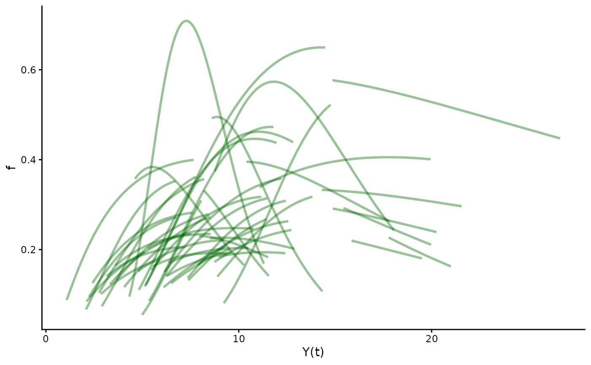
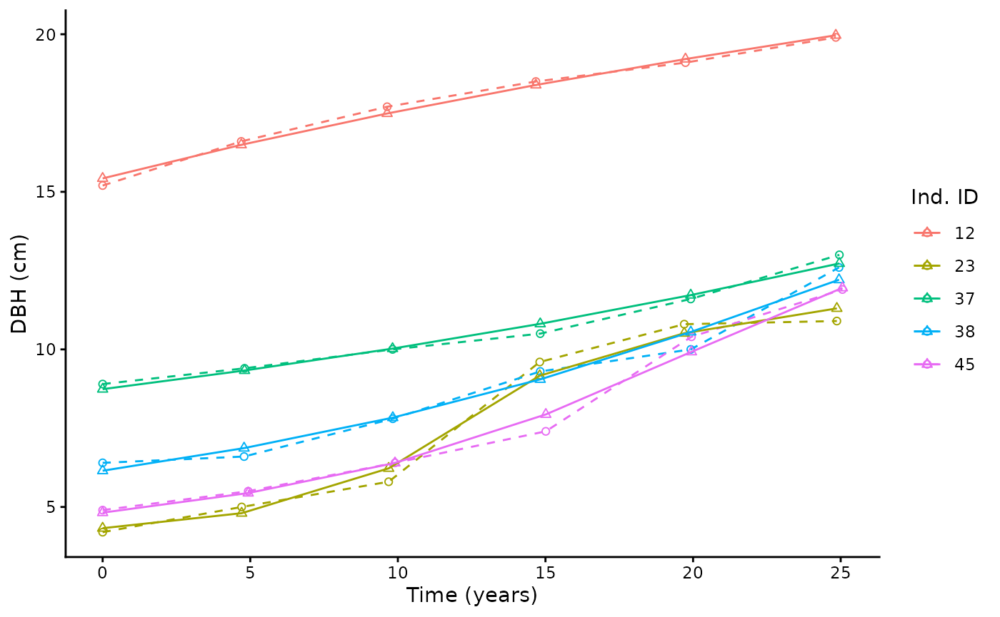

# hmde for Mathematicians

This vignette is intended for a statistical/mathematical audience who
are interested in Bayesian inverse problems. For biologists looking for
an applications-based walkthrough the other vignettes in this package –
`hmde`, `constant-growth`, `von-bertalanffy`, and `canham` – are less
theoretical.

## Getting started with {hmde}

‘hmde’ is under active development, you can install the development
version of ‘hmde’ from [GitHub](https://github.com/) with:

``` r
# install.packages("remotes")
remotes::install_github("traitecoevo/hmde")
```

``` r
library(dplyr)
#> 
#> Attaching package: 'dplyr'
#> The following objects are masked from 'package:stats':
#> 
#>     filter, lag
#> The following objects are masked from 'package:base':
#> 
#>     intersect, setdiff, setequal, union
library(ggplot2)
library(hmde)
```

## The Theory

The underlying method that the hmde package implements leverages the
longitudinal structure of repeat measurement data to estimate parameters
for an underlying differential equation, as first demonstrated in . This
method is an example of a Bayesian inverse method for differential
equation estimation: we are attempting to estimate the parameters of a
chosen DE based on observations of the resulting process. We assume that
the data consists of a finite number of discrete (likely sparse)
observations with measurement error at the individual level, and have a
set number of possible differential equations ready to be fit to data.

### The Maths

In a general setting, we are interested in some quantity $Y(t)$ that
changes over time (approximately) according to a chosen DE $f$. We have
some finite finite number measurements at times $t_{j}$, and believe
that the underlying true behaviour is given by
$$Y\left( t_{j + 1} \right) = Y\left( t_{j} \right) + \int_{t_{j}}^{t_{j + 1}}f\left( Y(t),{\mathbf{θ}} \right)\, dt\qquad(1)$$
for unseen parameter vector $\mathbf{θ}$ that we wish to estimate. We
also have an initial condition $Y_{0} = Y\left( t_{0} \right)$.

We have three in-built growth functions in `hmde`.

- Constant: $f = \beta$ chosen as when you only have two observations
  the average growth rate is the best you can do. Furthermore, the
  results from the constant model align with a linear mixed effects
  model for size with individual parameter. The constant model is
  size-independent. As all numerical methods are equivalent and the same
  as the analytic solution given the initial condition, we use the Euler
  method for the constant model.

- von Bertalanffy:
  $$f = \beta\left( Y_{max} - Y(t) \right)\qquad\qquad(2)$$ which has a
  history of use in biology for species that grow to some maximum size,
  and represents a simple size-dependent linear function. If a power law
  model is desired, log-transforming observations and then
  back-transforming by exponentiation gives such a function.
  Equation (2) is implemented with the analytic solution rather than a
  numerical method, as it is a known nightmare example for numerical
  stability due to the negative coefficient on $Y(t)$.

- Canham:
  $$f = f_{max}\exp( - \frac{1}{2}(\frac{\log\left( Y(t)/Y_{max} \right)}{k})^{2}),\qquad\qquad(3)$$
  which is considered a reasonable approximation of long term growth
  behaviour for some tree species as shown in and \[Chapter 2\].
  Equation (3) is extremely non-linear and does not have an analytic
  solution, forcing the use of numerical methods in order to estimate
  the growth increments in Equation (1).

- Affine: $$f = \beta_{0} - \beta_{1}Y(t)$$ which is only included for
  demonstration purposes of where numerical methods can go wrong as it
  is a re-parameterisation of the von Bertalanffy model.

Choice of appropriate function is an exercise for the user and depends
on the available data. Aside from the affine model all have versions
that work with both a single individual, and multiple individuals. We
provide example data intended for use with each of the primary models: -
`Trout_Size_Data` for the constant model, - `Lizard_Size_Data` for the
von Bertalanffy model, - `Tree_Size_Data` for the Canham model.

### The Stats

We assume that we do not have access to $\mathbf{θ}$ or the true values
of $Y$ over time. Instead we have observations with measurement error,
$$y_{j} = Y\left( t_{j} \right) + \text{error},$$ and estimate
$\mathbf{θ}$ with $\widehat{\mathbf{θ}}$.

We use a hierarchical structure to encode different levels of
relationships within the data. At the bottom of the hierarchy is the
measurement level
$$y_{j} \sim \mathcal{N}\left( \widehat{Y}\left( t_{j} \right),\sigma_{e} \right),$$
where we assume normally distributed error. This may not always be true,
but indicated that symmetric error centred at 0 may be enough for
reasonable results. The longitudinal structure in Equation (1) serves as
the next level, connecting estimated sizes over time based on the chosen
function $f$ and estimated parameters $\widehat{\mathbf{θ}}$, which
operates at the level of the individual.

If the data has multiple individuals we add additional layers that act
as hyper-parameters on the distributions of elements of each individual
$i$’s ${\widehat{\mathbf{θ}}}_{i}$. We build these to be independent
$\theta_{ki}$s, with log-mean and log-standard deviation parameters
$$\theta_{k} \sim \log\mathcal{N}\left( \mu_{k},\sigma_{k} \right),$$
and typically use the following priors:
$$\mu_{k} \sim \mathcal{N}(0,2),\quad 0 < \sigma_{k} \sim Cauchy(0,2).$$
For details on the prior distributions see the vignette for a specific
model or check the Stan file. To see the default values run `hmde_model`
on the model name as a string and look at the `prior_pars` argument for
the parameter name:

``` r
hmde_model("canham_multi_ind")
#> [1] "Model: canham_multi_ind"
#> [1] "Input data template:"
#> $n_obs
#> NULL
#> 
#> $n_ind
#> NULL
#> 
#> $y_obs
#> NULL
#> 
#> $obs_index
#> NULL
#> 
#> $time
#> NULL
#> 
#> $ind_id
#> NULL
#> 
#> $prior_pars_pop_log_max_growth_mean
#> [1] 0 2
#> 
#> $prior_pars_pop_log_max_growth_sd
#> [1] 0 2
#> 
#> $prior_pars_pop_log_size_at_max_growth_mean
#> [1] 0 2
#> 
#> $prior_pars_pop_log_size_at_max_growth_sd
#> [1] 0 2
#> 
#> $prior_pars_pop_log_k_mean
#> [1] 0 2
#> 
#> $prior_pars_pop_log_k_sd
#> [1] 0 2
#> 
#> $prior_pars_global_error_sigma
#> [1] 0 2
#> 
#> $model
#> [1] "canham_multi_ind"
```

The error parameter $\sigma_{e} > 0$ is assumed to operate at a global
level independent of individual and typically has a Cauchy prior with
location 0, spread parameter 2.

Estimation is done using MCMC through Stan.

### Integration of time series

Numerical methods are required for the Canham model as it has no
analytic solution, and the inbuilt Stan Runge-Kutta 4-5 solver is used.

For the von Bertalanffy model an analytic solution is used in order to
avoid numerical problems. For the constant model all numerical methods
are the same and give the same result as the analytic solution so Euler
is used.

## Demonstration: Canham Growth - Multiple Individuals

The provided tree data for 50 individuals takes a few hours to run. As
such, the following block does not run by default, and instead we
leverage the provided estimates data file: `Tree_Size_Ests`. The
estimates are posterior mean, median, and 95% central credible intervals
for parameters, and mean posterior estimates of sizes over time based on
the longitudinal model.

``` r
# Build fit and extract estimates
canham_multi_ind_fit <- hmde_model("canham_multi_ind") |>
  hmde_assign_data(data = Tree_Size_Data)  |>
  hmde_run(chains = 1, cores = 1, iter = 1000)

Tree_Size_Ests <- hmde_extract_estimates(fit = canham_multi_ind_fit,
                                 input_measurement_data = Tree_Size_Data)
```

The following code produces plots of the Canham function for each
individual between the first and last estimated size. The purpose of the
plot is to look at how different individual growth functions behave.

``` r
summary(Tree_Size_Ests)
#>                  Length Class  Mode     
#> model_name        1     -none- character
#> measurement_data  5     tbl_df list     
#> individual_data  13     tbl_df list     
#> error_data        5     tbl_df list     
#> population_data   5     tbl_df list

# Plot fitted growth function pieces
plot_par_individual_data <- Tree_Size_Ests$individual_data[,c(1, 2, 6, 10)] #Pull out estimates only
hmde_plot_de_pieces(Tree_Size_Ests)
```


Each line represents 25 years of growth for the specific individual.
Lines that sit lower on the $y$-axis are shorter horizontally because
they are traversed more slowly, as $f$ is the rate of change in $Y$.

To understand the error model, the following code plots a number of
individual sizes over time, then super-imposes those growth curves in
black on the individual growth function plots. To view a specific
individual, use the `ind_id` value to select them.

``` r
#Plots of size over time for a sample of 5 individuals
sample_ids <- sample(1:nrow(Tree_Size_Ests$individual_data), size=5) %>%
  sort()
plot_data <- Tree_Size_Ests$measurement_data %>%
  filter(ind_id %in% sample_ids)

ind_size_lims <- Tree_Size_Ests$measurement_data %>%
  filter(ind_id %in% sample_ids)%>%
  group_by(ind_id) %>%
  summarise(y_0 = min(y_hat),
         y_final = max(y_hat))

ggplot(data=plot_data, aes(group = ind_id)) +
  geom_point(aes(x = time, y=y_obs, colour = as.factor(ind_id)),
             shape = 1) +
  geom_line(aes(x = time, y=y_obs, colour = as.factor(ind_id)),
            linetype = "dashed") +
  geom_point(aes(x = time, y=y_hat, colour = as.factor(ind_id)),
             shape = 2) +
  geom_line(aes(x = time, y=y_hat, colour = as.factor(ind_id)),
            linetype = "solid") +
  labs(x="Time (years)", y="DBH (cm)", colour="Ind. ID") +
  theme_classic()
```



``` r

#Load DE for Canham
DE_function = hmde_model_des("canham_multi_ind")

#Produce plot with focus inds
function_plot <- hmde_plot_de_pieces(Tree_Size_Ests,
                    alpha = 0.2) 
for(i in 1:length(sample_ids)){
  args_list <- list(pars=Tree_Size_Ests$individual_data[sample_ids[i],c(2, 6, 10)])
  
  function_plot <- function_plot +
      geom_function(fun=DE_function, args=args_list,
                    colour="black", linewidth=1, alpha = 1,
                    xlim=c(ind_size_lims$y_0[i], ind_size_lims$y_final[i]))
    
}

function_plot
```


