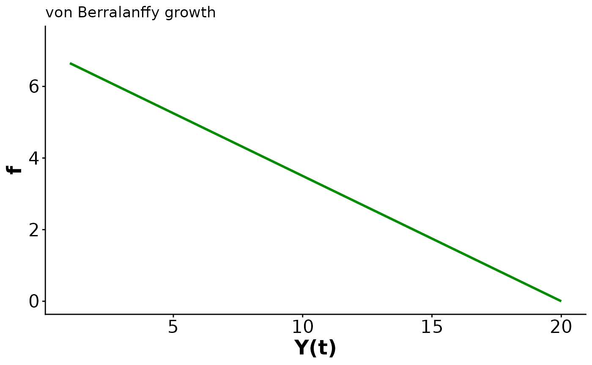
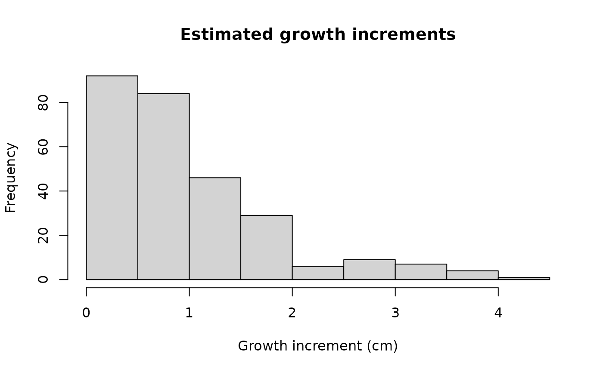

# Case study 2: von Bertalanffy growth with lizard size data

### Load dependencies

``` r
# remotes::install_github("traitecoevo/hmde")
# install.packages(c("dplyr", "ggplot2"))

library(hmde)
library(dplyr)
#> 
#> Attaching package: 'dplyr'
#> The following objects are masked from 'package:stats':
#> 
#>     filter, lag
#> The following objects are masked from 'package:base':
#> 
#>     intersect, setdiff, setequal, union
library(ggplot2)
```

## Overview

Our second demo introduces size-dependent growth based on the von
Bertalanffy function
$$f\left( Y(t);S_{max},\beta \right) = \beta\left( S_{max} - Y(t) \right),$$
where $S_{max}$ is the asymptotic maximum size and $\beta$ controls the
growth rate. We have implemented the analytic solution
$$Y(t) = S_{max} + \left( Y(0) - S_{max} \right)\exp( - t\beta)$$ which
is independent of age at the starting size $Y(0)$ and instead uses the
first size as the initial condition. The key behaviour of the von
Bertalanffy model is a high growth rate at small sizes that declines
linearly as the size approaches $S_{max}$. This manifests as growth
slowing as a creature matures with a hard finite limit on the eventual
size. We restrict $\beta$ and $S_{max}$ to be positive. As a result the
growth rate is non-negative.

### Priors

The default priors for the constant top-level parameters in the single
individual model are
$$S_{max} \sim \log\mathcal{N}\left( \log\left( \max\left( y_{obs} \right) \right),2 \right),$$$$\beta \sim \log\mathcal{N}(0,2),$$$$0 < \sigma_{e} \sim Cauchy(0,2).$$

For the multi-individual model the prior structure and default
parameters are
$$\mu_{S_{max}} \sim \mathcal{N}\left( \log\left( \max\left( y_{obs} \right) \right),2 \right),$$$$0 < \sigma_{S_{max}} \sim Cauchy(0,2),$$$$\mu_{\beta} \sim \mathcal{N}(0,2),$$$$0 < \sigma_{\beta} \sim Cauchy(0,2),$$$$0 < \sigma_{e} \sim Cauchy(0,2).$$
The max size parameter priors are always centred at the (transformed)
maximum observed size. This is not changeable, but the standard
deviation is. To see the name for the prior parameter run `hmde_model`.
For example in the following we want to change the prior for $S_{max}$
standard deviation (`ind_max_size`) in the individual model:

``` r
hmde_model("vb_single_ind")
#> [1] "Model: vb_single_ind"
#> [1] "Input data template:"
#> $n_obs
#> NULL
#> 
#> $y_obs
#> NULL
#> 
#> $obs_index
#> NULL
#> 
#> $time
#> NULL
#> 
#> $y_bar
#> NULL
#> 
#> $prior_pars_ind_max_size_sd_only
#> [1] 2
#> 
#> $prior_pars_ind_growth_rate
#> [1] 0 2
#> 
#> $prior_pars_global_error_sigma
#> [1] 0 2
#> 
#> $model
#> [1] "vb_single_ind"
#prior_pars_ind_max_size_sd_only is the argument name for the prior parameter
```

### Visualise model

In the following code we plot an example of the growth function and the
solution to get a feel for the behaviour.

``` r
#Analytic solution in function form
solution <- function(t, pars = list(y_0, beta, S_max)){
  return(
    pars$S_max + (y_0 - pars$S_max)*exp(-t * pars$beta)
  )
}

#Parameters
beta <- 0.35 #Growth rate
y_0 <- 1 #Starting size
S_max <- 20 #Asymptotic max size
time <- c(0,30) 
pars_list <- list(y_0 = y_0,
                  beta = beta,
                  S_max = S_max)
y_final <- solution(time[2], pars_list)

#Plot of growth function
ggplot() +
  xlim(y_0, y_final) +
  ylim(0, beta*(S_max-y_0)*1.1) +
  labs(x = "Y(t)", y = "f", title = "von Berralanffy growth") +
  theme_classic() +
  theme(axis.text=element_text(size=16),
        axis.title=element_text(size=18,face="bold")) +
  geom_function(fun=hmde_model_des("vb_single_ind"), 
                args=list(pars = list(S_max, beta)),
                colour="green4", linewidth=1,
                xlim=c(y_0, y_final))
```



``` r

#Size over time
ggplot() +
  geom_function(fun=solution, 
                args=list(pars = pars_list),
                colour="green4", linewidth=1,
                xlim=c(time)) +
  xlim(time) +
  ylim(0, y_final*1.05) +
  labs(x = "Time", y = "Y(t)", title = "von Bertalanffy growth") +
  theme_classic() +
  theme(axis.text=element_text(size=16),
        axis.title=element_text(size=18,face="bold"))
```


The von Bertalanffy model is commonly used in fishery management (Flinn
and Midway 2021), but has also been used in reptile studies such as
Edmonds et al. (2021) and Zhao et al. (2020).

## Lizard size data

Our data is sourced from Kar, Nakagawa, and Noble (2023) which measured
mass and snout-vent-length (SVL) of delicate skinks – – under
experimental conditions to examine the effect of temperature on
development. We are going to use the SVL metric for size.

We took a simple random sample without replacement of 50 individuals
with at least 5 observations each. The von Bertalanffy model can be fit
to shorter observation lengths, but fewer than 3 observations is not
advised as there are two growth parameters per individual.

## Implementation

The workflow for the second example is the same as the first, with the
change in model name and data object.

``` r
lizard_vb_fit <- hmde_model("vb_multi_ind") |>
  hmde_assign_data(data = Lizard_Size_Data)  |>
  hmde_run(chains = 4, cores = 1, iter = 2000)
#> 
#> SAMPLING FOR MODEL 'vb_multi_ind' NOW (CHAIN 1).
#> Chain 1: 
#> Chain 1: Gradient evaluation took 0.000159 seconds
#> Chain 1: 1000 transitions using 10 leapfrog steps per transition would take 1.59 seconds.
#> Chain 1: Adjust your expectations accordingly!
#> Chain 1: 
#> Chain 1: 
#> Chain 1: Iteration:    1 / 2000 [  0%]  (Warmup)
#> Chain 1: Iteration:  200 / 2000 [ 10%]  (Warmup)
#> Chain 1: Iteration:  400 / 2000 [ 20%]  (Warmup)
#> Chain 1: Iteration:  600 / 2000 [ 30%]  (Warmup)
#> Chain 1: Iteration:  800 / 2000 [ 40%]  (Warmup)
#> Chain 1: Iteration: 1000 / 2000 [ 50%]  (Warmup)
#> Chain 1: Iteration: 1001 / 2000 [ 50%]  (Sampling)
#> Chain 1: Iteration: 1200 / 2000 [ 60%]  (Sampling)
#> Chain 1: Iteration: 1400 / 2000 [ 70%]  (Sampling)
#> Chain 1: Iteration: 1600 / 2000 [ 80%]  (Sampling)
#> Chain 1: Iteration: 1800 / 2000 [ 90%]  (Sampling)
#> Chain 1: Iteration: 2000 / 2000 [100%]  (Sampling)
#> Chain 1: 
#> Chain 1:  Elapsed Time: 10.392 seconds (Warm-up)
#> Chain 1:                8.043 seconds (Sampling)
#> Chain 1:                18.435 seconds (Total)
#> Chain 1: 
#> 
#> SAMPLING FOR MODEL 'vb_multi_ind' NOW (CHAIN 2).
#> Chain 2: 
#> Chain 2: Gradient evaluation took 0.000101 seconds
#> Chain 2: 1000 transitions using 10 leapfrog steps per transition would take 1.01 seconds.
#> Chain 2: Adjust your expectations accordingly!
#> Chain 2: 
#> Chain 2: 
#> Chain 2: Iteration:    1 / 2000 [  0%]  (Warmup)
#> Chain 2: Iteration:  200 / 2000 [ 10%]  (Warmup)
#> Chain 2: Iteration:  400 / 2000 [ 20%]  (Warmup)
#> Chain 2: Iteration:  600 / 2000 [ 30%]  (Warmup)
#> Chain 2: Iteration:  800 / 2000 [ 40%]  (Warmup)
#> Chain 2: Iteration: 1000 / 2000 [ 50%]  (Warmup)
#> Chain 2: Iteration: 1001 / 2000 [ 50%]  (Sampling)
#> Chain 2: Iteration: 1200 / 2000 [ 60%]  (Sampling)
#> Chain 2: Iteration: 1400 / 2000 [ 70%]  (Sampling)
#> Chain 2: Iteration: 1600 / 2000 [ 80%]  (Sampling)
#> Chain 2: Iteration: 1800 / 2000 [ 90%]  (Sampling)
#> Chain 2: Iteration: 2000 / 2000 [100%]  (Sampling)
#> Chain 2: 
#> Chain 2:  Elapsed Time: 5.677 seconds (Warm-up)
#> Chain 2:                3.126 seconds (Sampling)
#> Chain 2:                8.803 seconds (Total)
#> Chain 2: 
#> 
#> SAMPLING FOR MODEL 'vb_multi_ind' NOW (CHAIN 3).
#> Chain 3: 
#> Chain 3: Gradient evaluation took 0.000101 seconds
#> Chain 3: 1000 transitions using 10 leapfrog steps per transition would take 1.01 seconds.
#> Chain 3: Adjust your expectations accordingly!
#> Chain 3: 
#> Chain 3: 
#> Chain 3: Iteration:    1 / 2000 [  0%]  (Warmup)
#> Chain 3: Iteration:  200 / 2000 [ 10%]  (Warmup)
#> Chain 3: Iteration:  400 / 2000 [ 20%]  (Warmup)
#> Chain 3: Iteration:  600 / 2000 [ 30%]  (Warmup)
#> Chain 3: Iteration:  800 / 2000 [ 40%]  (Warmup)
#> Chain 3: Iteration: 1000 / 2000 [ 50%]  (Warmup)
#> Chain 3: Iteration: 1001 / 2000 [ 50%]  (Sampling)
#> Chain 3: Iteration: 1200 / 2000 [ 60%]  (Sampling)
#> Chain 3: Iteration: 1400 / 2000 [ 70%]  (Sampling)
#> Chain 3: Iteration: 1600 / 2000 [ 80%]  (Sampling)
#> Chain 3: Iteration: 1800 / 2000 [ 90%]  (Sampling)
#> Chain 3: Iteration: 2000 / 2000 [100%]  (Sampling)
#> Chain 3: 
#> Chain 3:  Elapsed Time: 10.455 seconds (Warm-up)
#> Chain 3:                12.658 seconds (Sampling)
#> Chain 3:                23.113 seconds (Total)
#> Chain 3: 
#> 
#> SAMPLING FOR MODEL 'vb_multi_ind' NOW (CHAIN 4).
#> Chain 4: 
#> Chain 4: Gradient evaluation took 0.000101 seconds
#> Chain 4: 1000 transitions using 10 leapfrog steps per transition would take 1.01 seconds.
#> Chain 4: Adjust your expectations accordingly!
#> Chain 4: 
#> Chain 4: 
#> Chain 4: Iteration:    1 / 2000 [  0%]  (Warmup)
#> Chain 4: Iteration:  200 / 2000 [ 10%]  (Warmup)
#> Chain 4: Iteration:  400 / 2000 [ 20%]  (Warmup)
#> Chain 4: Iteration:  600 / 2000 [ 30%]  (Warmup)
#> Chain 4: Iteration:  800 / 2000 [ 40%]  (Warmup)
#> Chain 4: Iteration: 1000 / 2000 [ 50%]  (Warmup)
#> Chain 4: Iteration: 1001 / 2000 [ 50%]  (Sampling)
#> Chain 4: Iteration: 1200 / 2000 [ 60%]  (Sampling)
#> Chain 4: Iteration: 1400 / 2000 [ 70%]  (Sampling)
#> Chain 4: Iteration: 1600 / 2000 [ 80%]  (Sampling)
#> Chain 4: Iteration: 1800 / 2000 [ 90%]  (Sampling)
#> Chain 4: Iteration: 2000 / 2000 [100%]  (Sampling)
#> Chain 4: 
#> Chain 4:  Elapsed Time: 19.422 seconds (Warm-up)
#> Chain 4:                6.319 seconds (Sampling)
#> Chain 4:                25.741 seconds (Total)
#> Chain 4:
#> Warning: There were 122 divergent transitions after warmup. See
#> https://mc-stan.org/misc/warnings.html#divergent-transitions-after-warmup
#> to find out why this is a problem and how to eliminate them.
#> Warning: There were 4 chains where the estimated Bayesian Fraction of Missing Information was low. See
#> https://mc-stan.org/misc/warnings.html#bfmi-low
#> Warning: Examine the pairs() plot to diagnose sampling problems
#> Warning: The largest R-hat is NA, indicating chains have not mixed.
#> Running the chains for more iterations may help. See
#> https://mc-stan.org/misc/warnings.html#r-hat
#> Warning: Bulk Effective Samples Size (ESS) is too low, indicating posterior means and medians may be unreliable.
#> Running the chains for more iterations may help. See
#> https://mc-stan.org/misc/warnings.html#bulk-ess
#> Warning: Tail Effective Samples Size (ESS) is too low, indicating posterior variances and tail quantiles may be unreliable.
#> Running the chains for more iterations may help. See
#> https://mc-stan.org/misc/warnings.html#tail-ess

lizard_estimates <- hmde_extract_estimates(fit = lizard_vb_fit,
                                           input_measurement_data = Lizard_Size_Data)
```

As before, we can compare the observed sizes over time to those
predicted by the model.

``` r
measurement_data_transformed <- lizard_estimates$measurement_data %>%
  group_by(ind_id) %>%
  mutate(
    delta_y_obs = y_obs - lag(y_obs),
    obs_interval = time - lag(time),
    obs_growth_rate = delta_y_obs/obs_interval,
    delta_y_est = y_hat - lag(y_hat),
    est_growth_rate = delta_y_est/obs_interval
  ) %>%
  ungroup()


#Distributions of estimated growth and size
hist(measurement_data_transformed$y_hat, 
     main = "Estimated size distribution",
     xlab = "Size (cm)")
```


``` r
hist(measurement_data_transformed$delta_y_est, 
     main = "Estimated growth increments",
     xlab = "Growth increment (cm)")
```



``` r
hist(measurement_data_transformed$est_growth_rate, 
     main = "Estimated annualised growth rate distribution",
     xlab = "Growth rate (cm/yr)")
```


``` r

#Quantitative R^2
cor(measurement_data_transformed$y_obs, measurement_data_transformed$y_hat)^2
#> [1] 0.7416779
r_sq_est <- cor(lizard_estimates$measurement_data$y_obs,
                lizard_estimates$measurement_data$y_hat)^2
r_sq <- paste0("R^2 = ", 
               signif(r_sq_est,
                      digits = 3))

obs_scatter <- ggplot(data = lizard_estimates$measurement_data, 
       aes(x = y_obs, y = y_hat)) +
  geom_point(shape = 16, size = 1, colour = "green4") +
  xlab("Y obs.") +
  ylab("Y est.") +
  geom_abline(slope = 1, linetype = "dashed") +
  annotate("text", x = 25, y = 18, 
           label = r_sq) +
  theme_classic()

#Plots of size over time for a sample of 5 individuals
obs_est_ind <- hmde_plot_obs_est_inds(n_ind_to_plot = 5,
                       measurement_data = lizard_estimates$measurement_data) +
  theme(legend.position = "inside",
        legend.position.inside = c(0.8, 0.2))
```

We have two parameters at the individual level and are interested in
both their separate distributions, and if we see evidence of a
relationship between them. We can also use the individual parameter
estimates and estimated sizes to plot the growth function pieces.

``` r
#1-dimensional parameter distributions
s_max_hist <- ggplot(lizard_estimates$individual_data, 
       aes(ind_max_size_mean)) +
  geom_histogram(bins = 10,
                 colour = "black",
                 fill = "lightblue") +
  labs(x="S_max estimate") +
  theme_classic()

beta_hist <- ggplot(lizard_estimates$individual_data, 
       aes(ind_growth_rate_mean)) +
  geom_histogram(bins = 10,
                 colour = "black",
                 fill = "lightblue") +
  labs(x="beta estimate") +
  theme_classic()

#2-dimensional parameter distribution
par_scatter <- ggplot(data = lizard_estimates$individual_data, 
       aes(x = ind_max_size_mean, y = ind_growth_rate_mean)) +
  geom_point(shape = 16, size = 1, colour = "green4") +
  xlab("Individual max sizes (mm)") +
  ylab("Individual growth rate parameters") +
  theme_classic()

#Correlation of parameters
cor(lizard_estimates$individual_data$ind_max_size_mean,
    lizard_estimates$individual_data$ind_growth_rate_mean,
    method = "spearman")
#> [1] 0.5702281

#Plot function pieces over estimated sizes.
de_pieces <- hmde_plot_de_pieces(lizard_estimates)
```

At the hyper-parameter level for the whole population we have centre and
spread parameters for the log-normal distributions of $S_{max}$ and
$\beta$. As before, we can look at these as species-level features.

``` r
pars_CI_names <- c(
  "mean log max size",
  "mean max size in mm",
  "log max size standard deviation",
  "mean log growth par",
  "mean growth par mm/yr",
  "log growth par standard deviation"
)

#Vector that picks out which pars to be exponentiated
exp_vec <- c(FALSE, TRUE, FALSE, 
             FALSE, TRUE, FALSE)

#Print mean estimates and CIs
for(i in 1:nrow(lizard_estimates$population_data)){
  if(!exp_vec[i]){
    lizard_estimates$population_data$mean[i] 
    print(paste0("95% CI for ", 
                 pars_CI_names[i],
                 ": (",
                 lizard_estimates$population_data$CI_lower[i],
                 ", ",
                 lizard_estimates$population_data$CI_upper[i],
                 ")"))
  } else {
    exp(lizard_estimates$population_data$mean[i])
    print(paste0("95% CI for ",
                 pars_CI_names[i], 
                 ": (",
                 exp(lizard_estimates$population_data$CI_lower[i]),
                 ", ",
                 exp(lizard_estimates$population_data$CI_upper[i]),
                 ")"))
  }
}
#> [1] "95% CI for mean log max size: (3.17647083072528, 3.21407083090968)"
#> [1] "95% CI for mean max size in mm: (1.01045823319106, 1.04954895929649)"
#> [1] "95% CI for log max size standard deviation: (-4.14301908332485, -3.75812194862982)"
#> [1] "95% CI for mean log growth par: (0.0233751801356016, 0.237118800131887)"
```

## References

Edmonds, Devin, Michael J Dreslik, Jeffrey E Lovich, Thomas P Wilson,
and Carl H Ernst. 2021. “Growing as Slow as a Turtle: Unexpected
Maturational Differences in a Small, Long-Lived Species.” *PloS One* 16
(11): e0259978.

Flinn, Shane A, and Stephen R Midway. 2021. “Trends in Growth Modeling
in Fisheries Science.” *Fishes* 6 (1): 1.

Kar, Fonti, Shinichi Nakagawa, and Daniel W Noble. 2023. “Heritability
and Developmental Plasticity of Growth in an Oviparous Lizard.” OSF.
<https://doi.org/10.17605/OSF.IO/HJKXD>.

Zhao, Wei, Yangyang Zhao, Rui Guo, Yue Qi, Xiaoning Wang, and Na Li.
2020. “Age and Annual Growth Rate Cause Spatial Variation in Body Size
in Phrynocephalus Przewalskii (Agamid).” *Ecology and Evolution* 10
(24): 14189–95.
